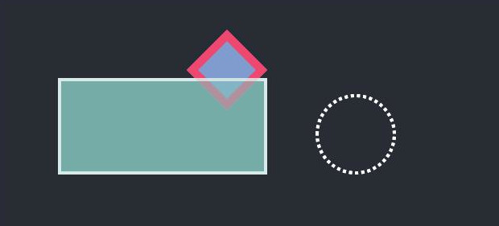

# canvas-drawing

A bunch of functions with css like arguments that make canvas drawing easier

## Example with React
```javascript
import React, { useEffect, useRef } from 'react'
import { drawRectangle } from '@constellation-org/canvas-drawing'

function App() {
  const canvasRef = useRef<HTMLCanvasElement>(null)

  useEffect(() => {
    const context = canvasRef.current.getContext('2d')
    drawDiamond(context, {
      x: 260,
      y: 40,
      width: 100,
      height: 100,
      borderColor: '#ef476f',
      borderWidth: 10,
      backgroundColor: '#809bce'
    })
    drawRectangle(context, {
      x: 100,
      y: 100,
      width: 260,
      height: 120,
      borderColor: '#FFF',
      backgroundColor: '#83c5be',
      opacity: 0.6
    })
    drawEllipse(context, {
      x: 420,
      y: 120,
      width: 100,
      height: 100,
      borderColor: '#FFF',
      borderStyle: 'dotted'
    })
  }, [])
  return (
    <canvas ref={canvasRef} />
  )

}
```


## drawRectangle, drawEllipse, drawDiamond

| Parameter | Type     | Description                       |
| :-------- | :------- | :-------------------------------- |
| `x`       | `number` | **Required**. X position of the top left corner |
| `y`       | `number` | **Required**. Y position of the top left corner |
| `width`   | `number` | **Required**. Total width of the rectangle, borders included |
| `height`  | `number` | **Required**. Total height of the rectangle, borders included |
| `opacity`  | `number` | Between 0 and 1. Default: 1 |
| `backgroundColor`  | `string` | A string parsed as [CSS](https://developer.mozilla.org/en-US/docs/Web/CSS/CSS_colors) color or a [CanvasGradient](https://developer.mozilla.org/en-US/docs/Web/API/CanvasGradient) object |
| `borderStyle`  | `"solid"` \| `"dashed"` \| `"dotted"` | Default: solid |
| `borderColor`  | `string` | A string parsed as [CSS](https://developer.mozilla.org/en-US/docs/Web/CSS/CSS_colors) color or a [CanvasGradient](https://developer.mozilla.org/en-US/docs/Web/API/CanvasGradient) object |
| `borderWidth`  | `number` | Default: 4 |


